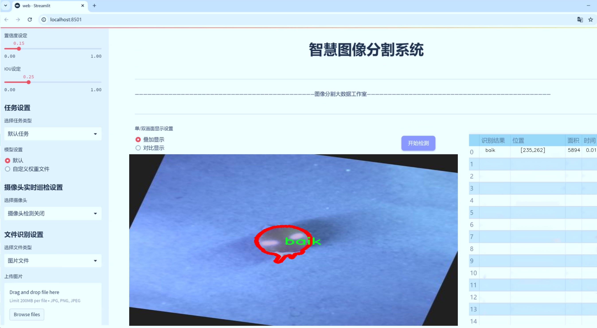
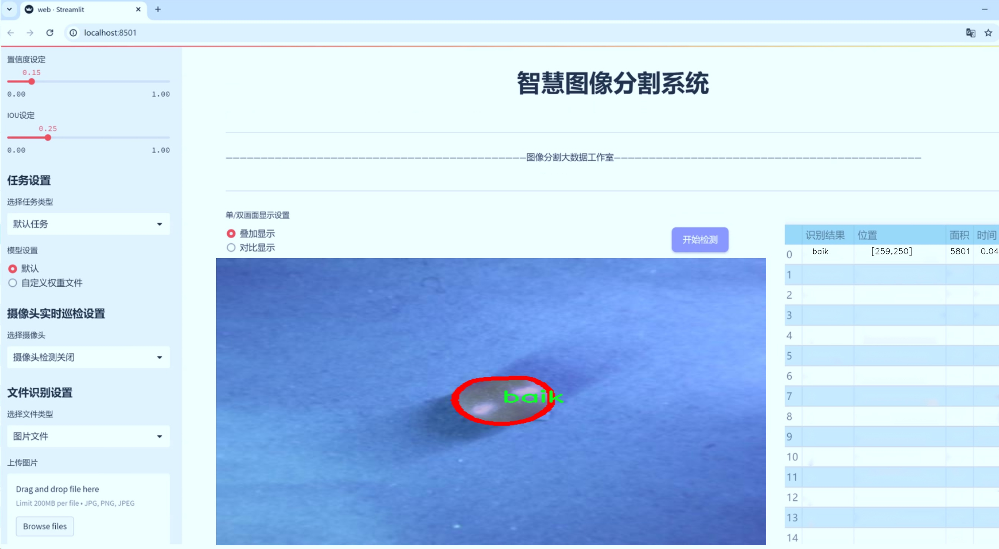
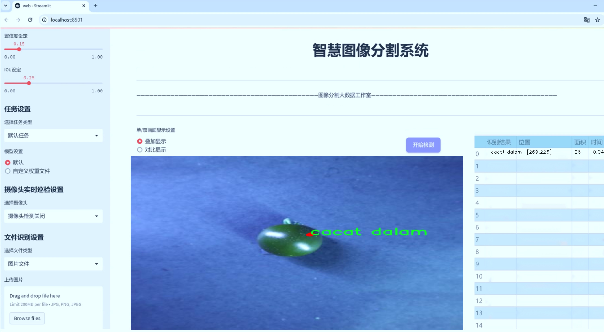
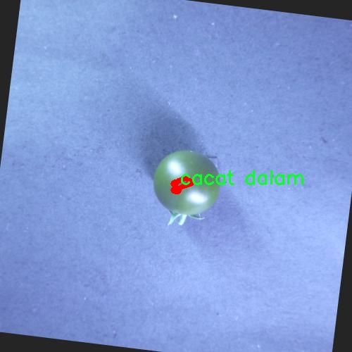
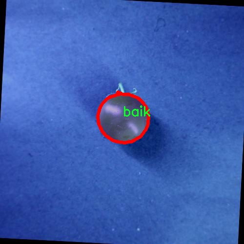
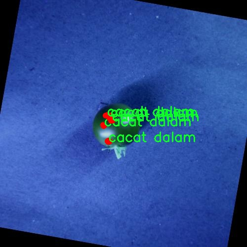
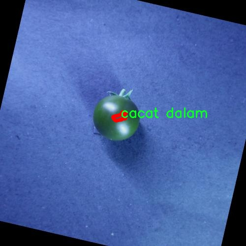
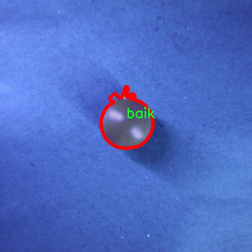

# 番茄损伤分割系统： yolov8-seg-bifpn

### 1.研究背景与意义

[参考博客](https://gitee.com/YOLOv8_YOLOv11_Segmentation_Studio/projects)

[博客来源](https://kdocs.cn/l/cszuIiCKVNis)

研究背景与意义

随着全球农业生产的不断发展，作物的健康与品质成为了提高农业产值和保障食品安全的重要因素。番茄作为一种广泛种植的经济作物，其品质直接影响到市场的供应和消费者的选择。然而，番茄在生长和运输过程中常常遭受各种损伤，这些损伤不仅影响了其外观和口感，还可能导致经济损失。因此，开发一种高效的番茄损伤检测与分割系统，能够为农业生产提供科学依据，提升番茄的市场竞争力，具有重要的现实意义。

近年来，计算机视觉技术的迅猛发展为农业领域的智能化管理提供了新的机遇。尤其是基于深度学习的目标检测与分割技术，已被广泛应用于作物病害识别、果实成熟度判断等任务。YOLO（You Only Look Once）系列模型因其高效的实时检测能力和良好的精度，成为了目标检测领域的热门选择。YOLOv8作为该系列的最新版本，进一步提升了模型的性能，尤其在小目标检测和复杂背景下的表现上，显示出了显著的优势。因此，基于改进YOLOv8的番茄损伤分割系统的研究，具有重要的理论和实践价值。

本研究将利用包含1100张图像的“Kerusakan Tomat”数据集，该数据集涵盖了四类番茄损伤，包括“baik”（良好）、“cacat dalam”（内部缺陷）、“memar”（压伤）和“sayat”（划伤）。这些类别的划分不仅有助于研究不同类型损伤对番茄品质的影响，也为后续的智能分拣和质量控制提供了基础。通过对这些损伤类型的精准分割与识别，能够实现对番茄品质的自动化评估，从而提高生产效率，降低人工成本。

此外，随着消费者对食品安全和质量要求的提高，传统的人工检测方法已难以满足现代农业生产的需求。基于YOLOv8的番茄损伤分割系统，不仅能够提高检测的准确性和效率，还能为农民提供实时的损伤评估反馈，帮助他们及时采取措施，减少损失。通过引入深度学习技术，该系统能够不断学习和优化，适应不同环境和条件下的番茄损伤检测，具有良好的推广前景。

综上所述，基于改进YOLOv8的番茄损伤分割系统的研究，不仅能够为番茄的质量控制提供科学依据，还能推动农业智能化的发展，提升农业生产的整体效益。这一研究不仅具有重要的学术价值，也为实际应用提供了新的思路和方法，预示着未来农业管理的智能化与自动化趋势。

### 2.图片演示







注意：本项目提供完整的训练源码数据集和训练教程,由于此博客编辑较早,暂不提供权重文件（best.pt）,需要按照6.训练教程进行训练后实现上图效果。

### 3.视频演示

[3.1 视频演示](https://www.bilibili.com/video/BV1FhzbYXE1E/)

### 4.数据集信息

##### 4.1 数据集类别数＆类别名

nc: 4
names: ['baik', 'cacat dalam', 'memar', 'sayat']


##### 4.2 数据集信息简介

数据集信息展示

在本研究中，我们采用了名为“Kerusakan Tomat”的数据集，以训练和改进YOLOv8-seg模型，旨在实现高效的番茄损伤分割系统。该数据集专注于番茄的不同损伤类型，包含四个主要类别，分别为“baik”（完好）、“cacat dalam”（内部缺陷）、“memar”（挤压伤）和“sayat”（切割伤）。这些类别的选择不仅涵盖了番茄在生长、运输和存储过程中可能遭遇的多种损伤类型，还为模型的训练提供了丰富的样本，确保其在实际应用中的有效性和准确性。

数据集中的“baik”类别代表了健康且无损伤的番茄，作为对照组，它为模型提供了一个基准，帮助其学习如何识别完好的番茄与受损番茄之间的差异。“cacat dalam”类别则聚焦于那些在外观上看似完好的番茄，但内部却存在缺陷的样本。这一类别的存在极大地丰富了数据集的多样性，使得模型能够更好地识别潜在的内部损伤，从而提高其在实际应用中的准确性和可靠性。

“memar”类别主要包含那些因挤压或碰撞而造成的表面损伤。这类损伤在运输和存储过程中非常常见，识别此类损伤对于确保番茄的市场质量至关重要。通过对这一类别的学习，模型能够有效地检测出因外力作用而导致的损伤，从而为农产品的质量控制提供支持。最后，“sayat”类别则包括了因切割或其他人为因素造成的伤害，这种损伤通常会影响番茄的外观和保鲜期。通过对这一类别的训练，模型将能够识别出人为操作带来的损伤，从而帮助生产者和供应链管理者采取相应的措施，减少损失。

整个数据集不仅包含了多样化的样本，还注重了图像的质量和标注的准确性，以确保模型在训练过程中能够获得可靠的信息。每个类别的样本数量经过精心设计，以避免类别不平衡对模型训练的影响。此外，数据集中的图像涵盖了不同的拍摄角度、光照条件和背景环境，这些因素都将有助于提高模型的泛化能力，使其能够在各种实际场景中有效运行。

在数据预处理阶段，我们对图像进行了标准化处理，以适应YOLOv8-seg模型的输入要求。通过数据增强技术，如旋转、缩放和翻转等，我们进一步扩展了数据集的规模，增强了模型的鲁棒性。最终，经过多轮的训练和验证，我们期望该模型能够在番茄损伤检测中实现高精度的分割效果，为农业生产和供应链管理提供有力的技术支持。

综上所述，“Kerusakan Tomat”数据集为本研究提供了坚实的基础，涵盖了番茄损伤的多种类型，确保了模型在实际应用中的有效性和可靠性。通过对该数据集的深入分析和应用，我们相信能够显著提升番茄损伤分割系统的性能，为农业领域的智能化发展贡献一份力量。











### 5.项目依赖环境部署教程（零基础手把手教学）

[5.1 环境部署教程链接（零基础手把手教学）](https://www.bilibili.com/video/BV1jG4Ve4E9t/?vd_source=bc9aec86d164b67a7004b996143742dc)


[5.2 安装Python虚拟环境创建和依赖库安装视频教程链接（零基础手把手教学）](https://www.bilibili.com/video/BV1nA4VeYEze/?vd_source=bc9aec86d164b67a7004b996143742dc)

### 6.手把手YOLOV8-seg训练视频教程（零基础手把手教学）

[6.1 手把手YOLOV8-seg训练视频教程（零基础小白有手就能学会）](https://www.bilibili.com/video/BV1cA4VeYETe/?vd_source=bc9aec86d164b67a7004b996143742dc)


按照上面的训练视频教程链接加载项目提供的数据集，运行train.py即可开始训练



     Epoch   gpu_mem       box       obj       cls    labels  img_size
     1/200     0G   0.01576   0.01955  0.007536        22      1280: 100%|██████████| 849/849 [14:42<00:00,  1.04s/it]
               Class     Images     Labels          P          R     mAP@.5 mAP@.5:.95: 100%|██████████| 213/213 [01:14<00:00,  2.87it/s]
                 all       3395      17314      0.994      0.957      0.0957      0.0843

     Epoch   gpu_mem       box       obj       cls    labels  img_size
     2/200     0G   0.01578   0.01923  0.007006        22      1280: 100%|██████████| 849/849 [14:44<00:00,  1.04s/it]
               Class     Images     Labels          P          R     mAP@.5 mAP@.5:.95: 100%|██████████| 213/213 [01:12<00:00,  2.95it/s]
                 all       3395      17314      0.996      0.956      0.0957      0.0845

     Epoch   gpu_mem       box       obj       cls    labels  img_size
     3/200     0G   0.01561    0.0191  0.006895        27      1280: 100%|██████████| 849/849 [10:56<00:00,  1.29it/s]
               Class     Images     Labels          P          R     mAP@.5 mAP@.5:.95: 100%|███████   | 187/213 [00:52<00:00,  4.04it/s]
                 all       3395      17314      0.996      0.957      0.0957      0.0845


### 7.50+种全套YOLOV8-seg创新点加载调参实验视频教程（一键加载写好的改进模型的配置文件）

[7.1 50+种全套YOLOV8-seg创新点加载调参实验视频教程（一键加载写好的改进模型的配置文件）](https://www.bilibili.com/video/BV1Hw4VePEXv/?vd_source=bc9aec86d164b67a7004b996143742dc)

### YOLOV8-seg算法简介

原始YOLOv8-seg算法原理

YOLOv8-seg算法是目标检测领域的一项重要进展，基于YOLOv8的架构，结合了目标分割的需求，旨在实现更高效的图像理解和物体识别。该算法的设计理念源于YOLO系列的成功，特别是YOLOv5和YOLOv7的架构优势，进一步优化了特征提取和目标检测的流程，以满足更复杂的应用场景。

首先，YOLOv8-seg算法的网络结构依然保持了YOLO系列的经典设计，包括输入层、主干网络、特征融合层和解耦头。其主干网络采用了CSPDarknet的思想，结合了C2f模块的创新设计，显著提高了模型的轻量化和检测精度。C2f模块的引入，允许网络在特征提取过程中进行更丰富的梯度流动，从而有效缓解了深层网络中的梯度消失问题。这一模块通过将特征图分为两个分支，分别进行特征的提取和融合，最终将输出的特征图进行合并，确保了信息的完整性和准确性。

在特征融合方面，YOLOv8-seg算法采用了PAN-FPN结构，这一结构的优势在于能够有效地整合来自不同层次的特征信息。通过自下而上的融合策略，算法能够将高层特征与中层和浅层特征进行充分结合，确保在目标检测时既能保留细节信息，又能获得语义信息的深度理解。这种多尺度特征融合的方式，使得YOLOv8-seg在处理复杂场景时表现出色，能够准确识别出小目标和细节丰富的物体。

值得注意的是，YOLOv8-seg算法在目标检测中引入了Anchor-Free的思想，摒弃了传统的Anchor-Base方法。这一创新使得模型在处理目标时更加灵活，能够适应不同尺寸和形状的物体。通过Task-Aligned的样本匹配策略，YOLOv8-seg能够更好地进行正负样本的分配，确保训练过程中样本的多样性和代表性，从而提升模型的泛化能力。

在损失函数的设计上，YOLOv8-seg采用了VFLLoss和DFLLoss+CIoULoss的组合。这一组合不仅能够有效处理样本不平衡的问题，还能在分类和回归任务中提供更精确的损失反馈。VFLLoss通过不对称参数的设置，使得正负样本在损失计算中得到不同的权重，从而引导模型更加关注高质量的正样本。这种设计思路在目标检测中尤为重要，因为在实际应用中，目标的种类和数量往往存在显著的不平衡性。

YOLOv8-seg在数据预处理方面延续了YOLOv5的策略，采用了马赛克增强、混合增强、空间扰动和颜色扰动等多种数据增强手段。这些增强技术的应用，不仅提高了模型的鲁棒性，还在一定程度上提升了检测精度。通过将输入图像转换为640x640的RGB图像，YOLOv8-seg能够在训练过程中充分利用丰富的图像信息，从而实现更好的特征学习。

此外，YOLOv8-seg的Head结构采用了解耦头的设计，分类和回归任务被分为两个独立的分支。这一设计的优势在于，分类和定位任务可以独立优化，从而提高了模型的整体性能。通过对不同尺度的特征图进行处理，YOLOv8-seg能够在80x80、40x40和20x20的特征图上进行目标检测，确保在不同分辨率下的目标都能被准确识别。

总的来说，YOLOv8-seg算法在目标检测和分割领域展现出了强大的能力。通过对YOLO系列的深入研究和创新，YOLOv8-seg不仅继承了前辈算法的优点，还在特征提取、融合和损失计算等多个方面进行了有效的改进。这使得YOLOv8-seg在实际应用中，尤其是在复杂场景下，能够提供更高的精度和更快的检测速度，为目标检测领域带来了新的机遇和挑战。随着YOLOv8-seg的推广和应用，未来的图像理解和物体识别将更加智能化和高效化。


### 9.系统功能展示（检测对象为举例，实际内容以本项目数据集为准）

图9.1.系统支持检测结果表格显示

  图9.2.系统支持置信度和IOU阈值手动调节

  图9.3.系统支持自定义加载权重文件best.pt(需要你通过步骤5中训练获得)

  图9.4.系统支持摄像头实时识别

  图9.5.系统支持图片识别

  图9.6.系统支持视频识别

  图9.7.系统支持识别结果文件自动保存

  图9.8.系统支持Excel导出检测结果数据


### 10.50+种全套YOLOV8-seg创新点原理讲解（非科班也可以轻松写刊发刊，V11版本正在科研待更新）

#### 10.1 由于篇幅限制，每个创新点的具体原理讲解就不一一展开，具体见下列网址中的创新点对应子项目的技术原理博客网址【Blog】：


[10.1 50+种全套YOLOV8-seg创新点原理讲解链接](https://gitee.com/qunmasj/good)

#### 10.2 部分改进模块原理讲解(完整的改进原理见上图和技术博客链接)【如果此小节的图加载失败可以通过CSDN或者Github搜索该博客的标题访问原始博客，原始博客图片显示正常】
### YOLOv8简介
YOLOv8目标检测算法继承了YOLOv1系列的思考,是一种新型端到端的目标检测算法,尽管现在原始检测算法已经开源,但是鲜有发表的相关论文.YOLOv8的网络结构如图所示,主要可分为Input输入端、Backbone骨干神经网络、Neck 混合特征网络层和Head预测层网络共4个部分.

YOLO目标检测算法是一种端到端的One-Slage 目标检测算法，其核心思想是将图像按区域分块进行预测。YOLO将输入图像按照32x32的大小划分成若干个网格，例如416x416的图像将被划分为13x13个网格。当目标物体的中心位于某个网格内时,该网格就会负责输出该物体的边界框和类别置信度。每个网格可以预测多个边界框和多个目标类别,这些边界框和类别的数量可以根据需要进行设置。YOLO算法的输出是一个特征图,包含了每个网格对应的边界框和类别置信度的信息呵。本文采用YOLO最新的YOLOv8模型，其是2022年底发布的最新YOLO系列模型，采用全新的SOTA模型，全新的网络主干结构,如图1所示。
整个网络分为Backbone 骨干网络部分和Head头部网络部分。YOLOv8汲取了前几代网络的优秀特性，骨干网络和 Neck部分遵循CSP的思想，将YOLOv5中的C3模块被替换成了梯度流更丰富C2模块,去掉YOLOv5中 PAN-FPN上采样阶段中的卷积结构,将Backbone不同阶段输出的特征直接送入了上采样操作,模型提供了N/S/M/L/X尺度的不同大小模型,能够满足不同领域业界的需求。本文基于YOLOv8模型设计番茄病虫害检测系统，通过配置模型参数训练番茄图像,得到能够用于部署应用的最优模型。


### 感受野注意力卷积（RFAConv)
#### 标准卷积操作回顾
标准的卷积操作是构造卷积神经网络的基本构件。它利用具有共享参数的滑动窗口提取特征信息，克服了全连通层构造神经网络固有的参数多、计算开销大的问题。设 X R∈C×H×W
表示输入特征图，其中C、H、W分别表示特征图的通道数、高度、宽度。为了清楚地演示卷积核的特征提取过程，我们使用 C = 1 的例子。从每个接受域滑块中提取特征信息的卷积运算可以表示为:


这里，Fi 表示计算后每个卷积滑块得到的值，Xi 表示每个滑块内对应位置的像素值，K表示卷积核，S表示卷积核中的参数个数，N表示接收域滑块的总数。可以看出，每个滑块内相同位置的 feature共享相同的参数Ki。因此，标准的卷积运算并不能捕捉到不同位置所带来的信息差异，这最终在一定程度上限制了卷积神经网络的性能。 

#### 空间注意力回顾
目前，空间注意机制是利用学习得到的注意图来突出每个特征的重要性。与前一节类似，这里以 C=1为例。突出关键特征的空间注意机制可以简单表述为:这里，Fi 表示加权运算后得到的值。xi 和Ai 表示输入特征图和学习到的注意图在不同位置的值，N为输入特征图的高和宽的乘积，表示像素值的总数。


#### 空间注意与标准卷积运算
将注意力机制整合到卷积神经网络中，可以提高卷积神经网络的性能。通过对标准卷积运算和现有空间注意机制的研究，我们认为空间注意机制有效地克服了卷积神经网络固有的参数共享的局限性。目前卷积神经网络中最常用的核大小是 1 × 1和3 × 3。在引入空间注意机制后，提取特征的卷积操作可以是 1 × 1或3 × 3卷积操作。为了直观地展示这个过程，在 1 × 1卷积运算的前面插入了空间注意机制。通过注意图对输入特征图(Re-weight“×”)进行加权运算，最后通过 1 × 1卷积运算提取接收域的滑块特征信息。整个过程可以简单地表示如下:


 这里卷积核K仅代表一个参数值。如果取A i× ki 的值作为一种新的卷积核参数，有趣的是它解决了 1×1卷积运算提取特征时的参数共享问题。然而，关于空间注意机制的传说到此结束。当空间注意机制被插入到3×3卷积运算前面时。具体情况如下:


如上所述，如果取A的值 i × ki (4)式作为一种新的卷积核参数，完全解决了大规模卷积核的参数共享问题。然而，最重要的一点是，卷积核在提取每个接受域滑块的特征时，会共享一些特征。换句话说，每个接收域滑块内都有一个重叠。仔细分析后会发现A12= a21， a13 = a22， a15 = a24……，在这种情况下，每个滑动窗口共享空间注意力地图的权重。因此，空间注意机制没有考虑整个接受域的空间特征，不能有效地解决大规模卷积核的参数共享问题。因此，空间注意机制的有效性受到限制。 

#### 创新空间注意力和标准卷积操作
该博客提出解决了现有空间注意机制的局限性，为空间处理提供了一种创新的解决方案。受RFA的启发，一系列空间注意机制被开发出来，可以进一步提高卷积神经网络的性能。RFA可以看作是一个轻量级即插即用模块，RFA设计的卷积运算(RFAConv)可以代替标准卷积来提高卷积神经网络的性能。因此，我们预测空间注意机制与标准卷积运算的结合将继续发展，并在未来带来新的突破。
接受域空间特征:为了更好地理解接受域空间特征的概念，我们将提供相关的定义。接收域空间特征是专门为卷积核设计的，并根据核大小动态生成。如图1所示，以3×3卷积核为例。在图1中，“Spatial Feature”指的是原始的Feature map。“接受域空间特征”是空间特征变换后的特征图。

 

由不重叠的滑动窗口组成。当使用 3×3卷积内核提取特征时，接收域空间特征中的每个 3×3大小窗口代表一个接收域滑块。接受域注意卷积(RFAConv):针对接受域的空间特征，我们提出了接受域注意卷积(RFA)。该方法不仅强调了接收域滑块内不同特征的重要性，而且对接收域空间特征进行了优先排序。通过该方法，完全解决了卷积核参数共享的问题。接受域空间特征是根据卷积核的大小动态生成的，因此，RFA是卷积的固定组合，不能与卷积操作的帮助分离，卷积操作同时依赖于RFA来提高性能，因此我们提出了接受场注意卷积(RFAConv)。具有3×3大小的卷积核的RFAConv整体结构如图所示。


目前，最广泛使用的接受域特征提取方法是缓慢的。经过大量的研究，我们开发了一种快速的方法，用分组卷积来代替原来的方法。具体来说，我们利用相应大小的分组卷积来动态生成基于接受域大小的展开特征。尽管与原始的无参数方法(如PyTorch提供的nn.())相比，该方法增加了一些参数，但它的速度要快得多。注意:如前一节所述，当使用 3×3卷积内核提取特征时，接收域空间特征中的每个 3×3大小窗口表示一个接收域滑块。而利用快速分组卷积提取感受野特征后，将原始特征映射为新的特征。最近的研究表明。交互信息可以提高网络性能，如[40,41,42]所示。同样，对于RFAConv来说，通过交互接受域特征信息来学习注意图可以提高网络性能。然而，与每个接收域特征交互会导致额外的计算开销，因此为了最小化计算开销和参数的数量，我们使用AvgPool来聚合每个接收域特征的全局信息。然后，使用 1×1 组卷积操作进行信息交互。最后，我们使用softmax来强调每个特征在接受域特征中的重要性。一般情况下，RFA的计算可以表示为:


这里gi×i 表示一个大小为 i×i的分组卷积，k表示卷积核的大小，Norm表示归一化，X表示输入的特征图，F由注意图 a相乘得到 rf 与转换后的接受域空间特征 Frf。与CBAM和CA不同，RFA能够为每个接受域特征生成注意图。卷积神经网络的性能受到标准卷积操作的限制，因为卷积操作依赖于共享参数，对位置变化带来的信息差异不敏感。然而，RFAConv通过强调接收域滑块中不同特征的重要性，并对接收域空间特征进行优先级排序，可以完全解决这个问题。通过RFA得到的feature map是接受域空间特征，在“Adjust Shape”后没有重叠。因此，学习到的注意图将每个接受域滑块的特征信息聚合起来。换句话说，注意力地图不再共享在每个接受域滑块。这完全弥补了现有 CA和CBAM注意机制的不足。RFA为标准卷积内核提供了显著的好处。而在调整形状后，特征的高度和宽度是 k倍，需要进行 stride = k的k × k卷积运算来提取特征信息。RFA设计的卷积运算RFAConv为卷积带来了良好的增益，对标准卷积进行了创新。
此外，我们认为现有的空间注意机制应该优先考虑接受域空间特征，以提高网络性能。众所周知，基于自注意机制的网络模型[43,44,45]取得了很大的成功，因为它解决了卷积参数共享的问题，并对远程信息进行建模。然而，自注意机制也为模型引入了显著的计算开销和复杂性。我们认为，将现有的空间注意机制的注意力引导到接受场空间特征上，可以以类似于自我注意的方式解决长期信息的参数共享和建模问题。与自我关注相比，这种方法需要的参数和计算资源少得多。答案如下:(1)将以接收场空间特征为中心的空间注意机制与卷积相结合，消除了卷积参数共享的问题。(2)现有的空间注意机制已经考虑了远程信息，可以通过全局平均池或全局最大池的方式获取全局信息，其中明确考虑了远程信息。因此，我们设计了新的 CBAM和CA模型，称为RFCBAM和RFCA，它们专注于接受域空间特征。与RFA类似，使用最终的k × k stride = k 的卷积运算来提取特征信息。这两种新的卷积方法的具体结构如图 3所示，我们称这两种新的卷积操作为 RFCBAMConv和RFCAConv。与原来的CBAM相比，我们在RFCBAM中使用SE attention来代替CAM。因为这样可以减少计算开销。此外，在RFCBAM中，通道注意和空间注意不是分开执行的。相反，它们是同时加权的，使得每个通道获得的注意力地图是不同的。


### 11.项目核心源码讲解（再也不用担心看不懂代码逻辑）

#### 11.1 ultralytics\trackers\utils\gmc.py

以下是对代码中最核心部分的提取和详细中文注释：

```python
import cv2
import numpy as np
from ultralytics.utils import LOGGER

class GMC:
    """
    一般化运动补偿 (GMC) 类，用于视频帧中的跟踪和物体检测。

    该类提供了基于多种跟踪算法（包括 ORB、SIFT、ECC 和稀疏光流）进行跟踪和检测的方法。
    还支持对帧进行下采样以提高计算效率。
    """

    def __init__(self, method='sparseOptFlow', downscale=2):
        """初始化 GMC 对象，指定跟踪方法和下采样因子。"""
        self.method = method  # 跟踪方法
        self.downscale = max(1, int(downscale))  # 下采样因子，确保至少为1

        # 根据选择的跟踪方法初始化相应的检测器和匹配器
        if self.method == 'orb':
            self.detector = cv2.FastFeatureDetector_create(20)
            self.extractor = cv2.ORB_create()
            self.matcher = cv2.BFMatcher(cv2.NORM_HAMMING)
        elif self.method == 'sift':
            self.detector = cv2.SIFT_create(nOctaveLayers=3, contrastThreshold=0.02, edgeThreshold=20)
            self.extractor = cv2.SIFT_create(nOctaveLayers=3, contrastThreshold=0.02, edgeThreshold=20)
            self.matcher = cv2.BFMatcher(cv2.NORM_L2)
        elif self.method == 'ecc':
            self.warp_mode = cv2.MOTION_EUCLIDEAN  # 运动模型
            self.criteria = (cv2.TERM_CRITERIA_EPS | cv2.TERM_CRITERIA_COUNT, 5000, 1e-6)  # 迭代终止条件
        elif self.method == 'sparseOptFlow':
            self.feature_params = dict(maxCorners=1000, qualityLevel=0.01, minDistance=1, blockSize=3)
        elif self.method in ['none', 'None', None]:
            self.method = None
        else:
            raise ValueError(f'错误: 未知的 GMC 方法: {method}')

        # 初始化存储变量
        self.prevFrame = None  # 前一帧
        self.prevKeyPoints = None  # 前一帧的关键点
        self.prevDescriptors = None  # 前一帧的描述符
        self.initializedFirstFrame = False  # 标志位，指示是否已处理第一帧

    def apply(self, raw_frame, detections=None):
        """在原始帧上应用对象检测，使用指定的方法。"""
        if self.method in ['orb', 'sift']:
            return self.applyFeatures(raw_frame, detections)  # 特征匹配方法
        elif self.method == 'ecc':
            return self.applyEcc(raw_frame, detections)  # ECC 方法
        elif self.method == 'sparseOptFlow':
            return self.applySparseOptFlow(raw_frame, detections)  # 稀疏光流方法
        else:
            return np.eye(2, 3)  # 返回单位矩阵

    def applyEcc(self, raw_frame, detections=None):
        """应用 ECC 算法进行运动补偿。"""
        height, width, _ = raw_frame.shape  # 获取帧的高度和宽度
        frame = cv2.cvtColor(raw_frame, cv2.COLOR_BGR2GRAY)  # 转换为灰度图
        H = np.eye(2, 3, dtype=np.float32)  # 初始化变换矩阵

        # 下采样图像
        if self.downscale > 1.0:
            frame = cv2.resize(frame, (width // self.downscale, height // self.downscale))

        # 处理第一帧
        if not self.initializedFirstFrame:
            self.prevFrame = frame.copy()  # 复制当前帧
            self.initializedFirstFrame = True  # 标记第一帧已初始化
            return H

        # 运行 ECC 算法
        try:
            (cc, H) = cv2.findTransformECC(self.prevFrame, frame, H, self.warp_mode, self.criteria)
        except Exception as e:
            LOGGER.warning(f'警告: 找到变换失败，设置为单位矩阵 {e}')

        return H

    def applyFeatures(self, raw_frame, detections=None):
        """应用特征匹配方法（如 ORB 或 SIFT）。"""
        height, width, _ = raw_frame.shape
        frame = cv2.cvtColor(raw_frame, cv2.COLOR_BGR2GRAY)
        H = np.eye(2, 3)

        # 下采样图像
        if self.downscale > 1.0:
            frame = cv2.resize(frame, (width // self.downscale, height // self.downscale))

        # 查找关键点
        keypoints = self.detector.detect(frame, None)

        # 处理第一帧
        if not self.initializedFirstFrame:
            self.prevFrame = frame.copy()
            self.prevKeyPoints = copy.copy(keypoints)
            self.initializedFirstFrame = True
            return H

        # 匹配描述符
        knnMatches = self.matcher.knnMatch(self.prevDescriptors, descriptors, 2)

        # 过滤匹配
        matches = []
        for m, n in knnMatches:
            if m.distance < 0.9 * n.distance:  # 使用比率测试
                matches.append(m)

        # 计算刚性变换矩阵
        if len(matches) > 4:
            prevPoints = np.array([self.prevKeyPoints[m.queryIdx].pt for m in matches])
            currPoints = np.array([keypoints[m.trainIdx].pt for m in matches])
            H, inliers = cv2.estimateAffinePartial2D(prevPoints, currPoints, cv2.RANSAC)

        # 更新前一帧和关键点
        self.prevFrame = frame.copy()
        self.prevKeyPoints = copy.copy(keypoints)

        return H

    def applySparseOptFlow(self, raw_frame, detections=None):
        """应用稀疏光流方法进行运动补偿。"""
        height, width, _ = raw_frame.shape
        frame = cv2.cvtColor(raw_frame, cv2.COLOR_BGR2GRAY)
        H = np.eye(2, 3)

        # 下采样图像
        if self.downscale > 1.0:
            frame = cv2.resize(frame, (width // self.downscale, height // self.downscale))

        # 查找关键点
        keypoints = cv2.goodFeaturesToTrack(frame, mask=None, **self.feature_params)

        # 处理第一帧
        if not self.initializedFirstFrame:
            self.prevFrame = frame.copy()
            self.prevKeyPoints = copy.copy(keypoints)
            self.initializedFirstFrame = True
            return H

        # 计算光流
        matchedKeypoints, status, err = cv2.calcOpticalFlowPyrLK(self.prevFrame, frame, self.prevKeyPoints, None)

        # 过滤有效匹配
        prevPoints = []
        currPoints = []
        for i in range(len(status)):
            if status[i]:
                prevPoints.append(self.prevKeyPoints[i])
                currPoints.append(matchedKeypoints[i])

        # 计算刚性变换矩阵
        if len(prevPoints) > 4:
            H, inliers = cv2.estimateAffinePartial2D(np.array(prevPoints), np.array(currPoints), cv2.RANSAC)

        # 更新前一帧和关键点
        self.prevFrame = frame.copy()
        self.prevKeyPoints = copy.copy(keypoints)

        return H
```

### 代码核心部分分析
1. **类的初始化 (`__init__`)**: 根据选择的跟踪方法初始化相应的检测器和匹配器，并设置下采样因子。
2. **应用方法 (`apply`)**: 根据选择的跟踪方法调用相应的处理函数（如 `applyFeatures`, `applyEcc`, `applySparseOptFlow`）。
3. **ECC 方法 (`applyEcc`)**: 处理图像并使用 ECC 算法计算变换矩阵，支持第一帧的初始化。
4. **特征匹配方法 (`applyFeatures`)**: 使用 ORB 或 SIFT 进行特征检测和描述符匹配，计算刚性变换矩阵。
5. **稀疏光流方法 (`applySparseOptFlow`)**: 使用稀疏光流计算关键点的运动，更新前一帧和关键点。

这些部分是实现运动补偿和对象跟踪的核心逻辑，涵盖了不同的跟踪算法和图像处理步骤。

这个文件定义了一个名为 `GMC` 的类，主要用于视频帧中的目标跟踪和检测。它实现了多种跟踪算法，包括 ORB、SIFT、ECC 和稀疏光流（Sparse Optical Flow），并支持对帧进行下采样以提高计算效率。

在类的初始化方法 `__init__` 中，用户可以指定所使用的跟踪方法和下采样因子。根据选择的跟踪方法，类会创建相应的特征检测器、描述符提取器和匹配器。例如，如果选择了 ORB 方法，则会使用 OpenCV 的 ORB 特征检测器和暴力匹配器；如果选择了 SIFT 方法，则会使用 SIFT 特征检测器和匹配器；对于 ECC 方法，类会设置相关的迭代次数和终止条件；而稀疏光流方法则会设置特征参数。

类的主要方法是 `apply`，它根据当前选择的跟踪方法对输入的原始帧进行处理。如果选择的是特征检测方法（如 ORB 或 SIFT），则调用 `applyFeatures` 方法；如果选择的是 ECC 方法，则调用 `applyEcc` 方法；如果选择的是稀疏光流，则调用 `applySparseOptFlow` 方法。每个方法的返回值是一个变换矩阵，用于描述当前帧与前一帧之间的运动。

在 `applyEcc` 方法中，首先将原始帧转换为灰度图像，并根据下采样因子对图像进行处理。若当前帧是第一帧，则会初始化前一帧的数据；否则，使用 ECC 算法计算当前帧与前一帧之间的变换矩阵。

`applyFeatures` 方法中，首先同样处理图像并检测关键点。然后计算描述符，并在后续步骤中通过匹配描述符来找到对应的关键点。通过 RANSAC 算法估计出一个刚性变换矩阵，最后更新前一帧的数据。

`applySparseOptFlow` 方法使用稀疏光流技术来跟踪关键点。它首先检测关键点，然后计算当前帧与前一帧之间的光流。与前两个方法类似，最终会估计出一个变换矩阵。

总的来说，这个 `GMC` 类为视频处理提供了一种灵活的方式，可以根据不同的需求选择合适的跟踪算法，并在处理过程中考虑到计算效率。

#### 11.2 ultralytics\nn\tasks.py

以下是代码中最核心的部分，并附上详细的中文注释：

```python
import torch
import torch.nn as nn

class BaseModel(nn.Module):
    """BaseModel类是Ultralytics YOLO系列模型的基类。"""

    def forward(self, x, *args, **kwargs):
        """
        模型的前向传播方法，处理单个尺度的输入。

        参数:
            x (torch.Tensor | dict): 输入图像张量或包含图像张量和真实标签的字典。

        返回:
            (torch.Tensor): 网络的输出。
        """
        if isinstance(x, dict):  # 如果输入是字典，表示训练或验证过程
            return self.loss(x, *args, **kwargs)  # 计算损失
        return self.predict(x, *args, **kwargs)  # 进行预测

    def predict(self, x, profile=False, visualize=False, augment=False):
        """
        通过网络执行前向传播。

        参数:
            x (torch.Tensor): 输入张量。
            profile (bool): 如果为True，打印每层的计算时间，默认为False。
            visualize (bool): 如果为True，保存模型的特征图，默认为False。
            augment (bool): 在预测时进行图像增强，默认为False。

        返回:
            (torch.Tensor): 模型的最后输出。
        """
        if augment:
            return self._predict_augment(x)  # 进行增强预测
        return self._predict_once(x, profile, visualize)  # 单次预测

    def _predict_once(self, x, profile=False, visualize=False):
        """
        执行一次前向传播。

        参数:
            x (torch.Tensor): 输入张量。
            profile (bool): 如果为True，打印每层的计算时间，默认为False。
            visualize (bool): 如果为True，保存模型的特征图，默认为False。

        返回:
            (torch.Tensor): 模型的最后输出。
        """
        y, dt = [], []  # 输出列表和时间列表
        for m in self.model:  # 遍历模型中的每一层
            if m.f != -1:  # 如果不是来自前一层
                x = y[m.f] if isinstance(m.f, int) else [x if j == -1 else y[j] for j in m.f]  # 从早期层获取输入
            if profile:
                self._profile_one_layer(m, x, dt)  # 记录当前层的计算时间
            x = m(x)  # 执行当前层的前向传播
            y.append(x if m.i in self.save else None)  # 保存输出
            if visualize:
                feature_visualization(x, m.type, m.i, save_dir=visualize)  # 可视化特征图
        return x  # 返回最后的输出

    def loss(self, batch, preds=None):
        """
        计算损失。

        参数:
            batch (dict): 用于计算损失的批次数据。
            preds (torch.Tensor | List[torch.Tensor]): 预测结果。

        返回:
            (torch.Tensor): 计算得到的损失值。
        """
        if not hasattr(self, 'criterion'):
            self.criterion = self.init_criterion()  # 初始化损失函数

        preds = self.forward(batch['img']) if preds is None else preds  # 如果没有预测结果，则进行前向传播
        return self.criterion(preds, batch)  # 计算损失

    def init_criterion(self):
        """初始化BaseModel的损失标准。"""
        raise NotImplementedError('compute_loss() needs to be implemented by task heads')  # 抛出未实现异常


class DetectionModel(BaseModel):
    """YOLOv8检测模型。"""

    def __init__(self, cfg='yolov8n.yaml', ch=3, nc=None, verbose=True):
        """使用给定的配置和参数初始化YOLOv8检测模型。"""
        super().__init__()
        self.yaml = cfg if isinstance(cfg, dict) else yaml_model_load(cfg)  # 加载配置字典

        # 定义模型
        ch = self.yaml['ch'] = self.yaml.get('ch', ch)  # 输入通道
        if nc and nc != self.yaml['nc']:
            self.yaml['nc'] = nc  # 覆盖YAML中的类别数
        self.model, self.save = parse_model(deepcopy(self.yaml), ch=ch, verbose=verbose)  # 解析模型
        self.names = {i: f'{i}' for i in range(self.yaml['nc'])}  # 默认名称字典

        # 初始化权重和偏置
        initialize_weights(self)

    def init_criterion(self):
        """初始化DetectionModel的损失标准。"""
        return v8DetectionLoss(self)  # 返回YOLOv8检测损失
```

### 代码核心部分解释
1. **BaseModel类**：这是所有YOLO模型的基类，定义了模型的基本结构和功能，包括前向传播、损失计算等。
2. **forward方法**：处理输入并决定是进行损失计算还是预测。
3. **predict方法**：执行前向传播，返回模型的输出。
4. **_predict_once方法**：实现一次前向传播的具体逻辑，遍历模型的每一层，执行计算并保存输出。
5. **loss方法**：计算损失，使用指定的损失标准。
6. **DetectionModel类**：继承自BaseModel，专门用于YOLOv8的检测任务，初始化模型时加载配置和权重。

以上是代码的核心部分及其详细注释，帮助理解YOLO模型的基本结构和功能。

这个程序文件 `ultralytics/nn/tasks.py` 是一个用于实现 YOLO（You Only Look Once）系列模型的基础类和具体模型类的代码文件。它包含了多种模型的定义，包括检测、分割、姿态估计和分类等任务。以下是对文件中主要内容的说明。

首先，文件导入了一些必要的库和模块，包括 PyTorch、Ultralytics 的一些自定义模块和工具函数。这些导入的模块提供了模型构建、损失计算、特征可视化等功能。

接下来，定义了一个基类 `BaseModel`，该类继承自 `nn.Module`，是所有 YOLO 模型的基础。它实现了模型的前向传播逻辑，包括预测和损失计算的方法。`BaseModel` 类中包含了多个重要的方法，如 `forward`、`predict`、`loss` 和 `load` 等。其中，`forward` 方法根据输入的类型（图像或字典）调用相应的处理逻辑，`predict` 方法用于执行前向传播并返回模型的输出，`loss` 方法用于计算模型的损失。

在 `BaseModel` 的基础上，定义了多个具体的模型类，如 `DetectionModel`、`SegmentationModel`、`PoseModel` 和 `ClassificationModel`。这些类分别实现了 YOLOv8 的检测、分割、姿态估计和分类功能。每个模型类都有自己的初始化方法，允许通过配置文件（YAML）加载模型结构和参数。

例如，`DetectionModel` 类专注于目标检测任务，它在初始化时解析模型配置，并构建模型结构。它还实现了特定于检测任务的损失计算方法 `init_criterion`，使用 `v8DetectionLoss` 来计算损失。

`SegmentationModel` 和 `PoseModel` 类分别继承自 `DetectionModel`，并实现了相应的损失计算方法，适用于分割和姿态估计任务。

`ClassificationModel` 类则是用于图像分类的模型，它的实现与其他模型类似，但其损失计算方法使用 `v8ClassificationLoss`。

此外，文件中还定义了一个 `Ensemble` 类，用于组合多个模型的输出，支持模型的集成学习。

在文件的最后部分，定义了一些辅助函数，如 `torch_safe_load`、`attempt_load_weights` 和 `yaml_model_load` 等。这些函数用于加载模型权重、解析模型配置文件以及处理模型的兼容性问题。

总的来说，这个文件是 YOLOv8 模型实现的核心部分，提供了模型的基础结构、前向传播逻辑、损失计算以及模型加载等功能，支持多种计算机视觉任务的实现。

#### 11.3 ultralytics\models\yolo\segment\val.py

以下是经过简化并添加详细中文注释的核心代码部分：

```python
import torch
import torch.nn.functional as F
from ultralytics.utils import ops
from ultralytics.utils.metrics import SegmentMetrics, box_iou, mask_iou
from ultralytics.utils.plotting import output_to_target, plot_images

class SegmentationValidator:
    """
    用于基于分割模型的验证的类。
    """

    def __init__(self, dataloader=None, save_dir=None, args=None):
        """初始化SegmentationValidator并设置任务为'segment'，度量标准为SegmentMetrics。"""
        self.dataloader = dataloader  # 数据加载器
        self.save_dir = save_dir  # 保存目录
        self.args = args  # 参数
        self.metrics = SegmentMetrics(save_dir=self.save_dir)  # 初始化度量标准
        self.plot_masks = []  # 用于存储绘图的掩码

    def preprocess(self, batch):
        """预处理批次，将掩码转换为浮点数并发送到设备。"""
        batch['masks'] = batch['masks'].to(self.device).float()  # 将掩码转移到设备并转换为浮点数
        return batch

    def postprocess(self, preds):
        """后处理YOLO预测，返回输出检测结果。"""
        # 使用非极大值抑制来过滤预测框
        p = ops.non_max_suppression(preds[0], self.args.conf, self.args.iou)
        proto = preds[1][-1] if len(preds[1]) == 3 else preds[1]  # 获取原型
        return p, proto

    def update_metrics(self, preds, batch):
        """更新度量标准。"""
        for si, (pred, proto) in enumerate(zip(preds[0], preds[1])):
            idx = batch['batch_idx'] == si  # 获取当前批次的索引
            cls = batch['cls'][idx]  # 获取当前批次的类别
            bbox = batch['bboxes'][idx]  # 获取当前批次的边界框
            nl, npr = cls.shape[0], pred.shape[0]  # 标签和预测的数量
            shape = batch['ori_shape'][si]  # 原始图像的形状

            if npr == 0:  # 如果没有预测
                continue

            # 处理掩码
            gt_masks = batch['masks'][idx]  # 获取真实掩码
            pred_masks = self.process(proto, pred[:, 6:], pred[:, :4], shape=batch['img'][si].shape[1:])  # 处理预测掩码

            # 评估
            if nl:  # 如果有标签
                correct_masks = self._process_batch(pred, cls, pred_masks, gt_masks)  # 处理掩码
                # 更新统计信息
                self.stats.append((correct_masks, pred[:, 4], pred[:, 5], cls.squeeze(-1)))

    def _process_batch(self, detections, labels, pred_masks, gt_masks):
        """
        返回正确的预测矩阵。
        """
        iou = mask_iou(gt_masks.view(gt_masks.shape[0], -1), pred_masks.view(pred_masks.shape[0], -1))  # 计算掩码的IoU
        return self.match_predictions(detections[:, 5], labels[:, 0], iou)  # 匹配预测和标签

    def plot_predictions(self, batch, preds, ni):
        """绘制批次预测结果，包括掩码和边界框。"""
        plot_images(batch['img'], *output_to_target(preds[0]), paths=batch['im_file'], fname=self.save_dir / f'val_batch{ni}_pred.jpg')

    def eval_json(self, stats):
        """返回COCO风格的目标检测评估指标。"""
        # 评估逻辑，略去具体实现
        return stats
```

### 代码注释说明：
1. **类的初始化**：`__init__`方法中初始化了数据加载器、保存目录和参数，并设置了度量标准。
2. **预处理**：`preprocess`方法负责将输入批次中的掩码转换为浮点数并移动到指定设备上。
3. **后处理**：`postprocess`方法使用非极大值抑制来过滤预测框，并返回处理后的预测结果。
4. **更新度量标准**：`update_metrics`方法根据预测结果和真实标签更新度量标准，计算掩码的IoU。
5. **绘制预测结果**：`plot_predictions`方法负责绘制预测结果，包括掩码和边界框。
6. **评估JSON**：`eval_json`方法用于返回COCO风格的评估指标，具体实现细节略去。 

该代码片段的核心功能是实现基于分割模型的验证过程，包括数据预处理、后处理、度量更新和结果绘制。

这个程序文件是一个用于YOLO（You Only Look Once）模型的分割验证器，主要用于对图像分割模型的输出进行评估和验证。它继承自`DetectionValidator`类，专门处理分割任务的相关功能。

首先，文件导入了一些必要的库，包括多线程处理、路径操作、NumPy、PyTorch等。接着，定义了`SegmentationValidator`类，该类的构造函数初始化了一些属性，如数据加载器、保存目录、进度条、参数和回调函数。它还设置了任务类型为“segment”，并初始化了用于评估的分割指标。

在`preprocess`方法中，输入的批次数据被预处理，具体来说是将掩码转换为浮点数并发送到指定的设备（如GPU）。`init_metrics`方法则根据是否需要保存JSON格式的结果来选择掩码处理函数，并初始化分割指标。

`get_desc`方法返回一个格式化的字符串，描述评估指标的结构。`postprocess`方法对YOLO模型的预测结果进行后处理，使用非极大值抑制（NMS）来过滤掉冗余的检测框，并返回处理后的预测结果和原型。

在`update_metrics`方法中，程序对每个批次的预测结果和真实标签进行比较，计算正确的掩码和边界框。它会根据不同的条件处理掩码和边界框的匹配，并更新统计信息。

`finalize_metrics`方法用于设置评估指标的速度和混淆矩阵。`_process_batch`方法则用于返回正确的预测矩阵，支持对掩码和边界框的处理。

此外，程序还提供了绘制验证样本和预测结果的功能，分别通过`plot_val_samples`和`plot_predictions`方法实现。这些方法会将图像、标签、边界框和掩码绘制到输出文件中。

`pred_to_json`方法用于将预测结果保存为JSON格式，适用于COCO数据集的评估。它会对每个预测的掩码进行RLE编码，并将结果存储在一个字典中。

最后，`eval_json`方法用于返回COCO风格的目标检测评估指标。它会检查是否需要保存JSON文件，并使用pycocotools库来计算mAP（平均精度均值）等指标。

总体来说，这个文件实现了YOLO分割模型的验证流程，包括数据预处理、指标计算、结果绘制和评估等功能，旨在帮助用户评估模型的性能。

#### 11.4 ultralytics\models\yolo\detect\predict.py

以下是代码中最核心的部分，并附上详细的中文注释：

```python
from ultralytics.engine.predictor import BasePredictor
from ultralytics.engine.results import Results
from ultralytics.utils import ops

class DetectionPredictor(BasePredictor):
    """
    DetectionPredictor类，继承自BasePredictor类，用于基于检测模型进行预测。
    """

    def postprocess(self, preds, img, orig_imgs):
        """
        后处理预测结果，返回Results对象的列表。

        参数:
        preds: 模型的预测结果，通常是边界框和置信度。
        img: 输入图像，通常是经过预处理的图像。
        orig_imgs: 原始输入图像，可能是一个批次的图像。

        返回:
        results: 包含每个图像预测结果的Results对象列表。
        """
        # 应用非极大值抑制（NMS）来过滤重叠的边界框
        preds = ops.non_max_suppression(preds,
                                         self.args.conf,  # 置信度阈值
                                         self.args.iou,   # IOU阈值
                                         agnostic=self.args.agnostic_nms,  # 是否进行类别无关的NMS
                                         max_det=self.args.max_det,  # 最大检测数量
                                         classes=self.args.classes)  # 过滤特定类别

        # 如果输入的原始图像不是列表，则将其转换为numpy数组
        if not isinstance(orig_imgs, list):  # 输入图像是torch.Tensor而不是列表
            orig_imgs = ops.convert_torch2numpy_batch(orig_imgs)  # 转换为numpy批次

        results = []  # 初始化结果列表
        for i, pred in enumerate(preds):  # 遍历每个预测结果
            orig_img = orig_imgs[i]  # 获取对应的原始图像
            # 将预测的边界框坐标从缩放后的图像空间转换回原始图像空间
            pred[:, :4] = ops.scale_boxes(img.shape[2:], pred[:, :4], orig_img.shape)
            img_path = self.batch[0][i]  # 获取图像路径
            # 创建Results对象并添加到结果列表中
            results.append(Results(orig_img, path=img_path, names=self.model.names, boxes=pred))
        return results  # 返回结果列表
```

### 代码核心部分说明：
1. **类定义**：`DetectionPredictor` 继承自 `BasePredictor`，用于处理基于检测模型的预测。
2. **后处理方法**：`postprocess` 方法负责对模型的预测结果进行后处理，包括应用非极大值抑制（NMS）和坐标转换。
3. **非极大值抑制**：通过 `ops.non_max_suppression` 函数过滤掉重叠的边界框，保留置信度高的框。
4. **图像转换**：将输入的原始图像从 PyTorch 张量转换为 NumPy 数组，以便后续处理。
5. **结果生成**：遍历每个预测结果，调整边界框坐标，并将每个结果封装成 `Results` 对象，最终返回所有结果的列表。

这个程序文件定义了一个名为 `DetectionPredictor` 的类，它继承自 `BasePredictor` 类，主要用于基于检测模型进行预测。文件开头包含了版权信息，表明该代码遵循 AGPL-3.0 许可证。

在类的文档字符串中，提供了一个简单的使用示例，展示了如何导入 `DetectionPredictor` 类并使用它进行预测。示例中，首先从 `ultralytics.utils` 导入了 `ASSETS`，然后创建了一个包含模型路径和数据源的字典 `args`。接着，实例化了 `DetectionPredictor` 对象，并调用 `predict_cli()` 方法进行预测。

类中定义了一个名为 `postprocess` 的方法，该方法用于对预测结果进行后处理。该方法接受三个参数：`preds`（预测结果）、`img`（输入图像）和 `orig_imgs`（原始图像）。在方法内部，首先调用 `ops.non_max_suppression` 函数对预测结果进行非极大值抑制，以过滤掉冗余的检测框。这个函数的参数包括置信度阈值、IOU 阈值、是否使用无关类别的 NMS、最大检测框数量以及指定的类别。

接下来，方法检查 `orig_imgs` 是否为列表。如果不是，则将其转换为 NumPy 数组格式。然后，方法初始化一个空的 `results` 列表，用于存储处理后的结果。通过遍历每个预测结果，方法会对每个预测框进行坐标缩放，以适应原始图像的尺寸，并将原始图像、图像路径、模型名称和预测框信息封装成 `Results` 对象，最后将其添加到 `results` 列表中。

最终，`postprocess` 方法返回一个包含所有结果的列表。这个类和方法的设计使得用户能够方便地进行目标检测，并对检测结果进行有效的后处理，以便后续分析或展示。

#### 11.5 ultralytics\engine\tuner.py

以下是代码中最核心的部分，并附上详细的中文注释：

```python
class Tuner:
    """
    负责YOLO模型超参数调优的类。

    该类通过在给定的迭代次数内变异超参数，并重新训练模型以评估其性能，从而演化YOLO模型的超参数。

    属性:
        space (dict): 超参数搜索空间，包含变异的边界和缩放因子。
        tune_dir (Path): 保存演化日志和结果的目录。
        tune_csv (Path): 保存演化日志的CSV文件路径。

    方法:
        _mutate(hyp: dict) -> dict:
            根据`self.space`中指定的边界变异给定的超参数。

        __call__():
            执行超参数演化的多个迭代。
    """

    def __init__(self, args=DEFAULT_CFG, _callbacks=None):
        """
        使用配置初始化Tuner。

        参数:
            args (dict, optional): 超参数演化的配置。
        """
        self.args = get_cfg(overrides=args)  # 获取配置
        self.space = {  # 定义超参数搜索空间
            'lr0': (1e-5, 1e-1),  # 初始学习率
            'lrf': (0.0001, 0.1),  # 最终学习率
            'momentum': (0.7, 0.98, 0.3),  # 动量
            'weight_decay': (0.0, 0.001),  # 权重衰减
            'warmup_epochs': (0.0, 5.0),  # 预热周期
            'box': (1.0, 20.0),  # 盒子损失增益
            'cls': (0.2, 4.0),  # 分类损失增益
            'hsv_h': (0.0, 0.1),  # HSV色调增强
            'hsv_s': (0.0, 0.9),  # HSV饱和度增强
            'hsv_v': (0.0, 0.9),  # HSV值增强
            'degrees': (0.0, 45.0),  # 图像旋转
            'translate': (0.0, 0.9),  # 图像平移
            'scale': (0.0, 0.95),  # 图像缩放
            'shear': (0.0, 10.0),  # 图像剪切
            'flipud': (0.0, 1.0),  # 图像上下翻转概率
            'fliplr': (0.0, 1.0),  # 图像左右翻转概率
            'mosaic': (0.0, 1.0),  # 图像混合概率
            'mixup': (0.0, 1.0),  # 图像混合概率
            'copy_paste': (0.0, 1.0)}  # 段落复制粘贴概率
        self.tune_dir = get_save_dir(self.args, name='tune')  # 获取保存目录
        self.tune_csv = self.tune_dir / 'tune_results.csv'  # CSV文件路径
        self.callbacks = _callbacks or callbacks.get_default_callbacks()  # 获取回调函数
        LOGGER.info(f"Tuner实例已初始化，保存目录为: {self.tune_dir}")

    def _mutate(self, parent='single', n=5, mutation=0.8, sigma=0.2):
        """
        根据`self.space`中指定的边界和缩放因子变异超参数。

        参数:
            parent (str): 父代选择方法: 'single' 或 'weighted'。
            n (int): 考虑的父代数量。
            mutation (float): 在任何给定迭代中参数变异的概率。
            sigma (float): 高斯随机数生成器的标准差。

        返回:
            (dict): 包含变异超参数的字典。
        """
        if self.tune_csv.exists():  # 如果CSV文件存在: 选择最佳超参数并变异
            # 选择父代
            x = np.loadtxt(self.tune_csv, ndmin=2, delimiter=',', skiprows=1)
            fitness = x[:, 0]  # 第一列为适应度
            n = min(n, len(x))  # 考虑的结果数量
            x = x[np.argsort(-fitness)][:n]  # 选择前n个适应度最高的结果
            w = x[:, 0] - x[:, 0].min() + 1E-6  # 权重
            if parent == 'single' or len(x) == 1:
                x = x[random.choices(range(n), weights=w)[0]]  # 加权选择
            elif parent == 'weighted':
                x = (x * w.reshape(n, 1)).sum(0) / w.sum()  # 加权组合

            # 变异
            r = np.random  # 随机数生成器
            r.seed(int(time.time()))  # 设置随机种子
            g = np.array([v[2] if len(v) == 3 else 1.0 for k, v in self.space.items()])  # 获取增益
            ng = len(self.space)
            v = np.ones(ng)
            while all(v == 1):  # 确保发生变异
                v = (g * (r.random(ng) < mutation) * r.randn(ng) * r.random() * sigma + 1).clip(0.3, 3.0)
            hyp = {k: float(x[i + 1] * v[i]) for i, k in enumerate(self.space.keys())}
        else:
            hyp = {k: getattr(self.args, k) for k in self.space.keys()}

        # 限制在边界内
        for k, v in self.space.items():
            hyp[k] = max(hyp[k], v[0])  # 下限
            hyp[k] = min(hyp[k], v[1])  # 上限
            hyp[k] = round(hyp[k], 5)  # 保留五位有效数字

        return hyp

    def __call__(self, model=None, iterations=10, cleanup=True):
        """
        当调用Tuner实例时执行超参数演化过程。

        参数:
           model (Model): 预初始化的YOLO模型，用于训练。
           iterations (int): 演化的代数。
           cleanup (bool): 是否删除迭代权重以减少存储空间。

        注意:
           该方法利用`self.tune_csv`路径对象读取和记录超参数及适应度分数。
        """
        t0 = time.time()  # 记录开始时间
        best_save_dir, best_metrics = None, None  # 初始化最佳保存目录和最佳指标
        (self.tune_dir / 'weights').mkdir(parents=True, exist_ok=True)  # 创建权重保存目录

        for i in range(iterations):
            # 变异超参数
            mutated_hyp = self._mutate()
            LOGGER.info(f'开始第 {i + 1}/{iterations} 次迭代，超参数: {mutated_hyp}')

            metrics = {}
            train_args = {**vars(self.args), **mutated_hyp}  # 合并超参数
            save_dir = get_save_dir(get_cfg(train_args))  # 获取保存目录
            try:
                # 使用变异的超参数训练YOLO模型
                weights_dir = save_dir / 'weights'
                cmd = ['yolo', 'train', *(f'{k}={v}' for k, v in train_args.items())]
                assert subprocess.run(cmd, check=True).returncode == 0, '训练失败'
                ckpt_file = weights_dir / ('best.pt' if (weights_dir / 'best.pt').exists() else 'last.pt')
                metrics = torch.load(ckpt_file)['train_metrics']  # 加载训练指标

            except Exception as e:
                LOGGER.warning(f'警告 ❌️ 第 {i + 1} 次超参数调优训练失败\n{e}')

            # 保存结果和变异超参数到CSV
            fitness = metrics.get('fitness', 0.0)  # 获取适应度
            log_row = [round(fitness, 5)] + [mutated_hyp[k] for k in self.space.keys()]
            headers = '' if self.tune_csv.exists() else (','.join(['fitness'] + list(self.space.keys())) + '\n')
            with open(self.tune_csv, 'a') as f:
                f.write(headers + ','.join(map(str, log_row)) + '\n')

            # 获取最佳结果
            x = np.loadtxt(self.tune_csv, ndmin=2, delimiter=',', skiprows=1)
            fitness = x[:, 0]  # 第一列为适应度
            best_idx = fitness.argmax()  # 获取最佳适应度索引
            best_is_current = best_idx == i  # 检查当前是否为最佳

            if best_is_current:
                best_save_dir = save_dir  # 更新最佳保存目录
                best_metrics = {k: round(v, 5) for k, v in metrics.items()}  # 更新最佳指标
                for ckpt in weights_dir.glob('*.pt'):
                    shutil.copy2(ckpt, self.tune_dir / 'weights')  # 复制最佳权重
            elif cleanup:
                shutil.rmtree(ckpt_file.parent)  # 删除迭代权重以减少存储空间

            # 绘制调优结果
            plot_tune_results(self.tune_csv)

            # 保存和打印调优结果
            header = (f'第 {i + 1}/{iterations} 次迭代完成 ✅ ({time.time() - t0:.2f}s)\n'
                      f'结果保存到 {self.tune_dir}\n'
                      f'最佳适应度={fitness[best_idx]} 在第 {best_idx + 1} 次迭代时观察到\n'
                      f'最佳适应度指标为 {best_metrics}\n'
                      f'最佳适应度模型为 {best_save_dir}\n'
                      f'最佳适应度超参数如下。\n')
            LOGGER.info('\n' + header)
            data = {k: float(x[best_idx, i + 1]) for i, k in enumerate(self.space.keys())}
            yaml_save(self.tune_dir / 'best_hyperparameters.yaml',
                      data=data,
                      header=remove_colorstr(header.replace(self.prefix, '# ')) + '\n')
            yaml_print(self.tune_dir / 'best_hyperparameters.yaml')  # 打印最佳超参数
```

### 代码核心部分解释
1. **Tuner类**: 该类负责超参数的调优，主要通过变异超参数并训练模型来评估性能。
2. **初始化方法**: 设置超参数的搜索空间和保存目录，并初始化回调函数。
3. **_mutate方法**: 负责变异超参数，选择父代并在指定范围内生成新的超参数。
4. **__call__方法**: 执行超参数演化的主逻辑，包括变异、训练模型、记录结果等。通过多次迭代来寻找最佳超参数配置。

这个程序文件是Ultralytics YOLO模型的超参数调优模块，主要用于对象检测、实例分割、图像分类、姿态估计和多目标跟踪等任务。超参数调优是一个系统性搜索最佳超参数集的过程，这对于深度学习模型（如YOLO）尤其重要，因为超参数的微小变化可能会导致模型性能的显著差异。

在文件中，首先导入了一些必要的库和模块，包括随机数生成、文件操作、时间处理、NumPy和PyTorch等。接着，定义了一个名为`Tuner`的类，该类负责YOLO模型的超参数调优。类中包含了多个属性和方法，主要功能是通过对超参数进行变异和重训练模型来评估其性能。

`Tuner`类的构造函数初始化了一些配置，包括超参数的搜索空间、调优结果保存目录和CSV文件路径等。搜索空间定义了每个超参数的最小值和最大值，以及可选的增益因子。该类还支持回调函数，以便在调优过程中进行监控和记录。

`_mutate`方法用于根据定义的搜索空间对超参数进行变异。它会选择历史上表现最好的超参数作为父代，并在此基础上进行变异。变异的过程包括生成随机数并根据一定的概率和标准差调整超参数的值，确保生成的新超参数在定义的范围内。

`__call__`方法是`Tuner`类的核心，负责执行超参数进化过程。该方法会循环进行指定次数的迭代，每次迭代中，首先加载或初始化超参数，然后调用`_mutate`方法生成变异后的超参数，接着使用这些超参数训练YOLO模型，并记录训练的性能指标。每次迭代的结果会被保存到CSV文件中，以便后续分析。

在每次迭代结束后，程序会检查当前迭代的结果是否为最佳结果，如果是，则保存最佳模型和相关超参数。同时，还会根据需要清理不再使用的文件，以节省存储空间。最后，程序会生成调优结果的可视化图表，并将最佳超参数保存为YAML格式文件。

总体而言，这个模块为YOLO模型的超参数调优提供了一个系统化的方法，通过不断的试验和优化，帮助用户找到最佳的模型配置，从而提升模型的性能。

### 12.系统整体结构（节选）

### 程序整体功能和构架概括

该程序是Ultralytics YOLO系列模型的实现，涵盖了目标检测、图像分割、姿态估计和超参数调优等功能。程序的整体架构分为几个主要模块：

1. **跟踪与特征提取**：`gmc.py` 提供了目标跟踪的工具，支持多种特征检测和匹配算法，适用于视频帧中的目标跟踪。
  
2. **模型定义与任务管理**：`tasks.py` 定义了YOLO模型的基础结构和具体实现，支持多种计算机视觉任务（如检测、分割等），并提供了模型的前向传播和损失计算逻辑。

3. **分割验证**：`val.py` 实现了分割模型的验证流程，包括数据预处理、指标计算和结果可视化，帮助用户评估分割模型的性能。

4. **检测预测**：`predict.py` 负责处理YOLO模型的预测逻辑，支持对输入图像进行目标检测，并对预测结果进行后处理。

5. **超参数调优**：`tuner.py` 提供了超参数调优的功能，通过对超参数进行变异和重训练，寻找最佳的模型配置以提升性能。

### 文件功能整理表

| 文件路径                                      | 功能描述                                                                                     |
|-------------------------------------------|------------------------------------------------------------------------------------------|
| `ultralytics/trackers/utils/gmc.py`     | 实现目标跟踪的工具类 `GMC`，支持多种特征检测和匹配算法，适用于视频帧中的目标跟踪。                       |
| `ultralytics/nn/tasks.py`               | 定义YOLO模型的基础类和具体模型类，支持多种计算机视觉任务的实现，包括前向传播和损失计算。                  |
| `ultralytics/models/yolo/segment/val.py` | 实现分割模型的验证流程，包括数据预处理、指标计算和结果可视化，帮助评估分割模型的性能。                   |
| `ultralytics/models/yolo/detect/predict.py` | 处理YOLO模型的预测逻辑，支持对输入图像进行目标检测，并对预测结果进行后处理。                             |
| `ultralytics/engine/tuner.py`           | 提供超参数调优功能，通过对超参数进行变异和重训练，寻找最佳模型配置以提升性能。                           |

这个程序整体上为用户提供了一个全面的计算机视觉解决方案，涵盖了从模型训练到评估和优化的各个方面。

### 13.图片、视频、摄像头图像分割Demo(去除WebUI)代码

在这个博客小节中，我们将讨论如何在不使用WebUI的情况下，实现图像分割模型的使用。本项目代码已经优化整合，方便用户将分割功能嵌入自己的项目中。
核心功能包括图片、视频、摄像头图像的分割，ROI区域的轮廓提取、类别分类、周长计算、面积计算、圆度计算以及颜色提取等。
这些功能提供了良好的二次开发基础。

### 核心代码解读

以下是主要代码片段，我们会为每一块代码进行详细的批注解释：

```python
import random
import cv2
import numpy as np
from PIL import ImageFont, ImageDraw, Image
from hashlib import md5
from model import Web_Detector
from chinese_name_list import Label_list

# 根据名称生成颜色
def generate_color_based_on_name(name):
    ......

# 计算多边形面积
def calculate_polygon_area(points):
    return cv2.contourArea(points.astype(np.float32))

...
# 绘制中文标签
def draw_with_chinese(image, text, position, font_size=20, color=(255, 0, 0)):
    image_pil = Image.fromarray(cv2.cvtColor(image, cv2.COLOR_BGR2RGB))
    draw = ImageDraw.Draw(image_pil)
    font = ImageFont.truetype("simsun.ttc", font_size, encoding="unic")
    draw.text(position, text, font=font, fill=color)
    return cv2.cvtColor(np.array(image_pil), cv2.COLOR_RGB2BGR)

# 动态调整参数
def adjust_parameter(image_size, base_size=1000):
    max_size = max(image_size)
    return max_size / base_size

# 绘制检测结果
def draw_detections(image, info, alpha=0.2):
    name, bbox, conf, cls_id, mask = info['class_name'], info['bbox'], info['score'], info['class_id'], info['mask']
    adjust_param = adjust_parameter(image.shape[:2])
    spacing = int(20 * adjust_param)

    if mask is None:
        x1, y1, x2, y2 = bbox
        aim_frame_area = (x2 - x1) * (y2 - y1)
        cv2.rectangle(image, (x1, y1), (x2, y2), color=(0, 0, 255), thickness=int(3 * adjust_param))
        image = draw_with_chinese(image, name, (x1, y1 - int(30 * adjust_param)), font_size=int(35 * adjust_param))
        y_offset = int(50 * adjust_param)  # 类别名称上方绘制，其下方留出空间
    else:
        mask_points = np.concatenate(mask)
        aim_frame_area = calculate_polygon_area(mask_points)
        mask_color = generate_color_based_on_name(name)
        try:
            overlay = image.copy()
            cv2.fillPoly(overlay, [mask_points.astype(np.int32)], mask_color)
            image = cv2.addWeighted(overlay, 0.3, image, 0.7, 0)
            cv2.drawContours(image, [mask_points.astype(np.int32)], -1, (0, 0, 255), thickness=int(8 * adjust_param))

            # 计算面积、周长、圆度
            area = cv2.contourArea(mask_points.astype(np.int32))
            perimeter = cv2.arcLength(mask_points.astype(np.int32), True)
            ......

            # 计算色彩
            mask = np.zeros(image.shape[:2], dtype=np.uint8)
            cv2.drawContours(mask, [mask_points.astype(np.int32)], -1, 255, -1)
            color_points = cv2.findNonZero(mask)
            ......

            # 绘制类别名称
            x, y = np.min(mask_points, axis=0).astype(int)
            image = draw_with_chinese(image, name, (x, y - int(30 * adjust_param)), font_size=int(35 * adjust_param))
            y_offset = int(50 * adjust_param)

            # 绘制面积、周长、圆度和色彩值
            metrics = [("Area", area), ("Perimeter", perimeter), ("Circularity", circularity), ("Color", color_str)]
            for idx, (metric_name, metric_value) in enumerate(metrics):
                ......

    return image, aim_frame_area

# 处理每帧图像
def process_frame(model, image):
    pre_img = model.preprocess(image)
    pred = model.predict(pre_img)
    det = pred[0] if det is not None and len(det)
    if det:
        det_info = model.postprocess(pred)
        for info in det_info:
            image, _ = draw_detections(image, info)
    return image

if __name__ == "__main__":
    cls_name = Label_list
    model = Web_Detector()
    model.load_model("./weights/yolov8s-seg.pt")

    # 摄像头实时处理
    cap = cv2.VideoCapture(0)
    while cap.isOpened():
        ret, frame = cap.read()
        if not ret:
            break
        ......

    # 图片处理
    image_path = './icon/OIP.jpg'
    image = cv2.imread(image_path)
    if image is not None:
        processed_image = process_frame(model, image)
        ......

    # 视频处理
    video_path = ''  # 输入视频的路径
    cap = cv2.VideoCapture(video_path)
    while cap.isOpened():
        ret, frame = cap.read()
        ......
```


### 14.完整训练+Web前端界面+50+种创新点源码、数据集获取


# [下载链接：https://mbd.pub/o/bread/Z5uUkphs](https://mbd.pub/o/bread/Z5uUkphs)